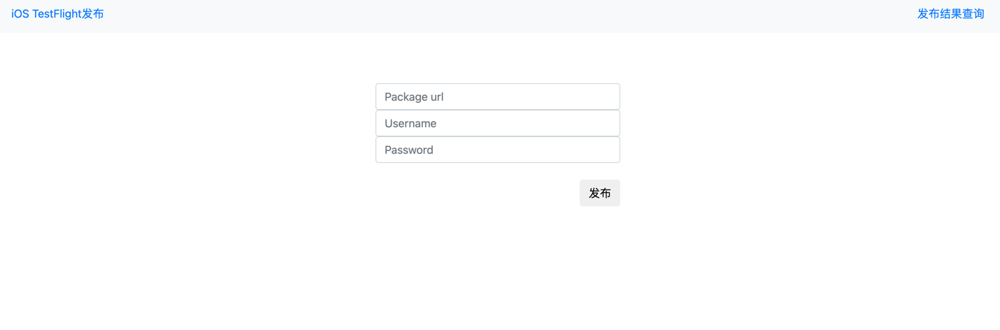
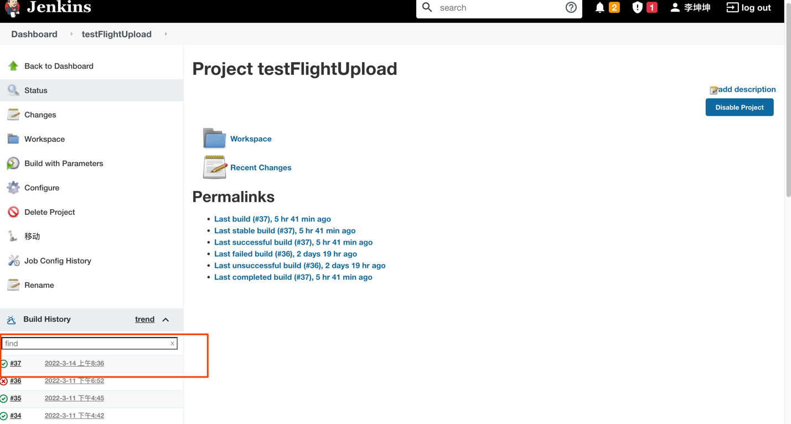

## ios testflight包发布工具
### 部署
采用docker部署方式：
* 构建镜像：docker build -f Dockerfile -t ios_testfilght .
* 启动容器：docker run -it -r -m -d -p 5000:5000 ios_testfilght
* 查看容器是否启动：docker ps | grep ios_testfilght
* 测试：curl http://本机ip:5000

访问页面：

* 填写package url 包的下载地址
* 苹果官网app管理者账号
* 账号密码
* 点击上传，开始上传
* 上传结果点击发布结果查询会跳转到jenkins查看任务状态 - 》上传成功
